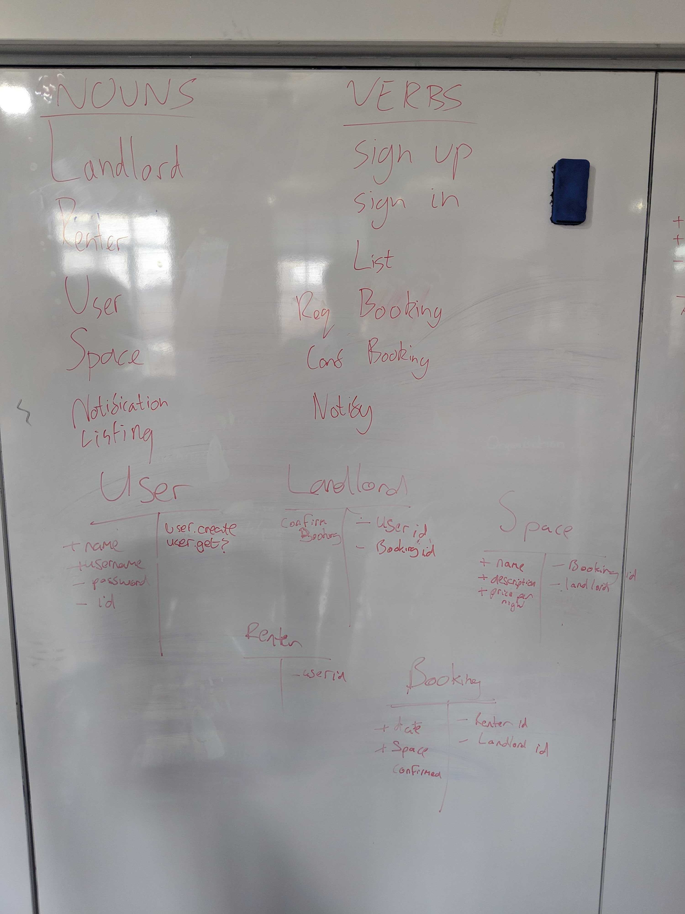
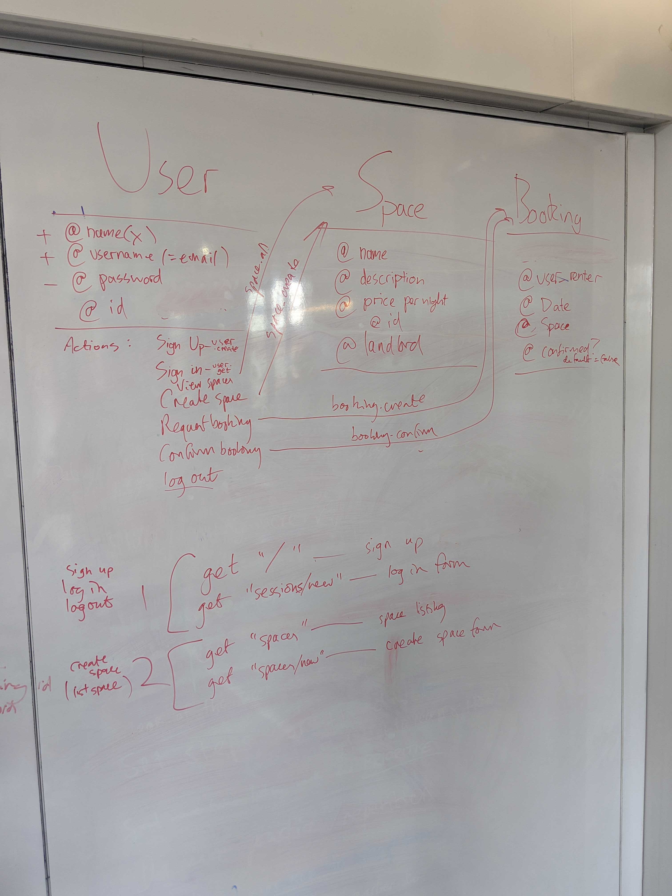

# Makers B'n'B
 
## Headline specifications
- Any signed-up user can list a new space.
  > As a landlord  
  > So that I can list a new space  
  > I want to be able to sign up 

  > As a landlord  
  > So that I can list a new space  
  > I want to be able to log in

  > As a landlord  
  > So that I can rent my space out  
  > I want to be able to list my space

- Users can list multiple spaces. **Not for MVP**
  > As a landlord  
  > So that I can make more money  
  > I want to list multiple spaces

- Users should be able to name their space, provide a short description of the space, and a price per night.
  > As a landlord  
  > So that I can sell my space  
  > I want to be able to provide a name, a description and a price

- Users should be able to offer a range of dates where their space is available. **Not for MVP**
  > As a landlord  
  > So that I can limit when people come round  
  > I want to specify a range of available dates for my space

- Any signed-up user can request to hire any space for one night, and this should be approved by the user that owns that space.
  > As a renter  
  > So that I can book a space  
  > I want to be able to request hiring a space for one night

  > As a landlord  
  > So that I can confirm a booking  
  > I want to be able to... confirm a booking

  > As a renter  
  > So that I know my booking has been accepted  
  > I want to receive notification

- Nights for which a space has already been booked should not be available for users to book that space. **Not for MVP**
  > As a landlord  
  > So that I don't get double booked  
  > I want nights that have been booked not to be available

- Until a user has confirmed a booking request, that space can still be booked for that night. **Not for MVP**
  > As a landlord  
  > So I can take my pick of the best renters  
  > I want my space to be available until booking is confirmed

## Domain modelling

